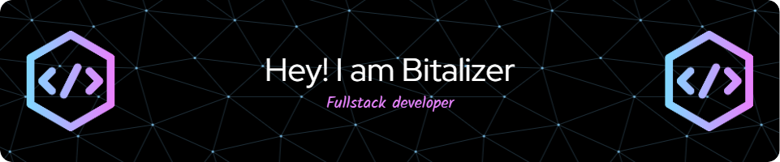

# 💻 Tech Stack

**Languages**

      

**Backend Frameworks**

   

**Frontend**

     

**Databases**

    

**Testing & Automation**

  

**Infrastructure & DevOps**

   

**Reverse Engineering**

   

**Network & Traffic Analysis**

   

<h1 align="left">📊 GitHub Stats</h1>

  
  

  

---

